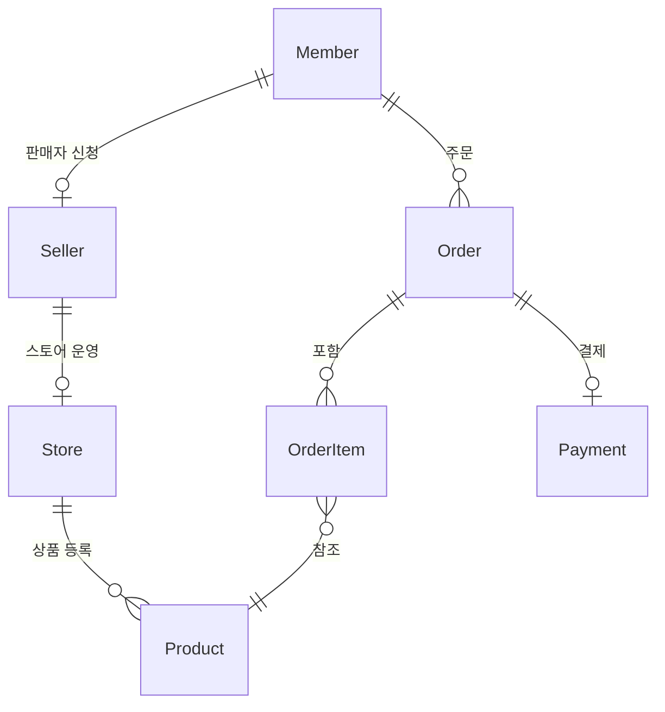
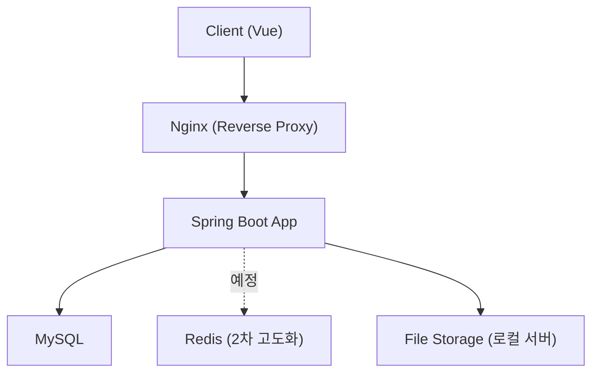
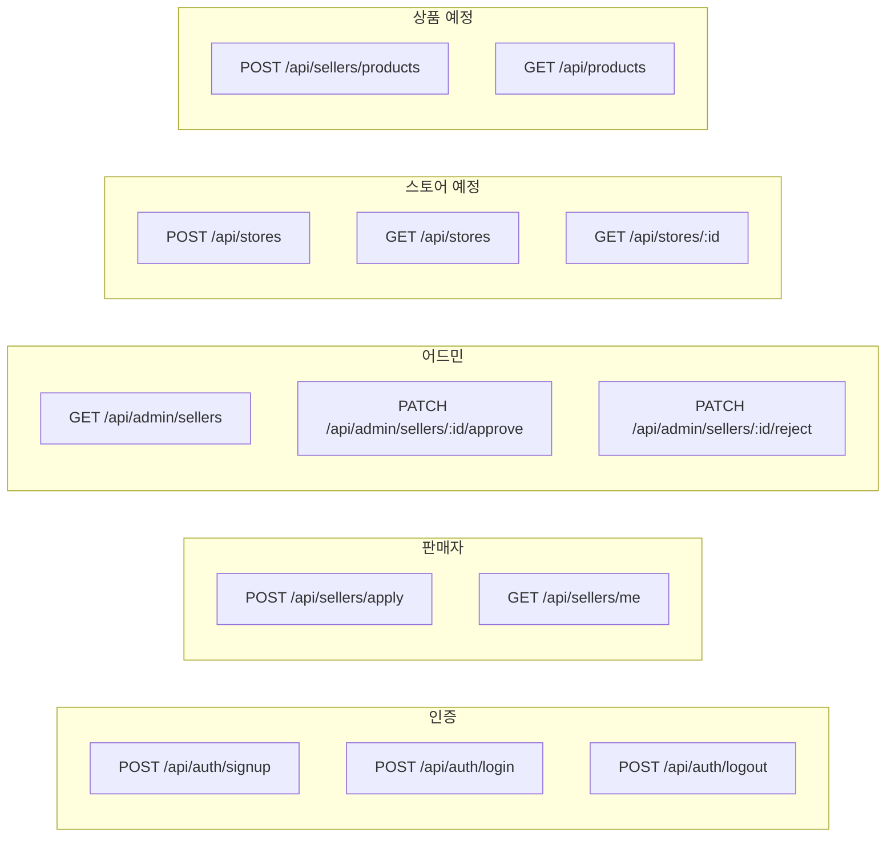

# IntelliMarket V2 | 다수 판매자 기반 오픈마켓 백엔드

> 팀 프로젝트 [Intelli Market](https://github.com/rekindle402/intellimarket)을 Spring Boot + JPA 구조로 개인 리팩토링한 후속 프로젝트입니다.
> 기능량보다 **도메인 설계 품질과 API 완성도**에 집중합니다.

---

## 프로젝트 개요

`2026.06 - 진행 중` · 개인 포트폴리오

**Tech Stack**
`Java` `Spring Boot` `Spring Security` `Spring Data JPA` `QueryDSL` `MySQL` `Flyway` `Docker` `Vue`

**[기획 배경]**
이전 팀 프로젝트에서 Spring MVC + MyBatis 구조로 오픈마켓 플랫폼을 구현했습니다.
당시 트랜잭션 원자성 미적용, 예외 처리 비표준화 등 설계 부채를 경험했고,
이를 Spring Boot + JPA 구조로 재설계하여 도메인 모델 품질과 API 완성도를 높이는 것이 목표입니다.

---

## 도메인 구조

<details>
<summary>ERD 다이어그램 펼치기</summary>
<br>



</details>

---

## 아키텍처

<details>
<summary>아키텍처 다이어그램 펼치기</summary>
<br>



</details>

---

## API 구조

<details>
<summary>API 구조 다이어그램 펼치기</summary>
<br>



</details>

---

## 구현 현황

### 1차 MVP

| 도메인 | 기능 | 상태 |
|--------|------|------|
| Auth | 회원가입, 로그인, 로그아웃, 내 정보 조회 | ✅ 완료 |
| Seller | 판매자 신청, 내 정보 조회 | ✅ 완료 |
| Admin - Seller | 목록/상세 조회, 승인, 거절 | ✅ 완료 |
| Store | 스토어 CRUD | 🔜 진행 예정 |
| Product | 상품 CRUD | 🔜 진행 예정 |
| 배포 | Docker + Nginx + DDNS | 🔜 진행 예정 |

### 2차 고도화

| 기능 | 상태 |
|------|------|
| 주문 생성 및 상태 관리 | 🔜 예정 |
| 결제 API 연동 | 🔜 예정 |
| 통계 기능 | 🔜 예정 |
| Redis 캐싱 | 🔜 예정 |

---

## 설계 포인트

### 예외 처리 구조
이전 팀 프로젝트에서 예외 처리 방식이 도메인마다 달랐던 경험을 바탕으로, 단일 `BusinessException` + 도메인별 `ErrorCode` 구조로 통일했습니다.

```
ErrorCode (interface)
    ↑
MemberErrorCode / SellerErrorCode / StoreErrorCode ...
    ↑
BusinessException (단일 클래스)
    ↑
GlobalExceptionHandler (단일 핸들러)
```

### QueryDSL 공통화
동적 검색 조건이 필요한 도메인마다 별도 QueryDSL 레포지토리를 만들고, `QuerydslSearchRepository` 인터페이스의 `default` 메서드로 페이징 로직을 공유합니다.

### Rich Domain Model
엔티티가 상태 변경 책임을 직접 갖도록 설계했습니다.
```java
seller.approve();        // 상태 변경 + approvedAt 설정
seller.reject(reason);   // 상태 변경 + rejectionReason + rejectedAt 설정
```

---

## 컨벤션 문서

| 문서 | 내용 |
|------|------|
| [API 컨벤션](.claude/rules/API-CONVENTIONS.md) | 공통 응답 래퍼, 페이징 구조, 날짜 포맷 |
| [도메인 명세](.claude/rules/DOMAIN-SPEC.md) | 전체 API 엔드포인트 및 권한 정의 |
| [예외 처리 전략](.claude/rules/EXCEPTION-SPEC.md) | 에러 응답 구조, 예외 클래스 계층, 에러 코드 |
| [Git 컨벤션](.claude/rules/GIT-CONVENTIONS.md) | 브랜치 전략, 커밋 메시지, PR 규칙 |
| [테스트 컨벤션](.claude/rules/TEST-CONVENTIONS.md) | 단위/통합 테스트 기준, 네이밍, 작성 기법 |

---

## Trouble Shooting

<details>
<summary><b>1. Spring Security 표준 인증 방식 전환 — AuthenticationSuccessHandler 미동작</b></summary>
<br>

**[문제]**
Controller에서 직접 `AuthenticationManager.authenticate()`를 호출하는 REST API 구조에서 `AuthenticationSuccessHandler`가 동작하지 않았습니다.

**[원인]**
`AuthenticationSuccessHandler`는 Spring Security 필터 체인(`UsernamePasswordAuthenticationFilter`) 기반 로그인에서만 호출됩니다.
REST API 방식은 필터 체인을 거치지 않으므로 핸들러 호출 시점 자체가 없습니다.

**[해결]**
`AuthenticationSuccessEvent`를 `@EventListener`로 구독하는 방식으로 전환해 인증 흐름과 로그인 후 부가 작업(`lastLoginAt` 갱신)의 책임을 분리했습니다.

**[교훈]**
Spring Security 확장 포인트는 표준 필터 체인을 전제로 동작합니다. 인증 흐름을 직접 구성한 경우 이벤트 기반 확장 포인트가 대안이 됩니다.
</details>

<details>
<summary><b>2. 이벤트 리스너에서 엔티티 수정이 DB에 반영되지 않음 — 준영속 상태</b></summary>
<br>

**[문제]**
`LoginSuccessListener`에서 `CustomUserDetails`로부터 꺼낸 `Member`의 `updateLastLoginAt()`을 호출했지만 DB에 반영되지 않았습니다.

**[원인]**
`loadUserByUsername()`이 조회한 `Member`는 해당 트랜잭션이 종료된 후 준영속(detached) 상태가 됩니다. 준영속 상태 엔티티는 JPA 변경 감지 대상이 아닙니다.

**[해결]**
리스너 트랜잭션 내에서 `memberRepository.findById()`로 엔티티를 다시 조회해 영속 상태로 만든 뒤 수정했습니다.

**[교훈]**
트랜잭션 경계를 넘어 전달된 엔티티는 준영속 상태일 수 있습니다. 다른 트랜잭션에서 변경이 필요하면 해당 트랜잭션 내에서 다시 조회해야 합니다.
</details>

<details>
<summary><b>3. QueryDSL 동적 쿼리 공통화 — fetchResults() deprecated, 추상 클래스 vs 인터페이스</b></summary>
<br>

**[문제]**
QueryDSL 5.x에서 `fetchResults()`가 deprecated됩니다. 또한 도메인마다 반복되는 페이징 로직을 추상 클래스로 공통화하려 했으나, `JpaRepository`와의 다중 상속 불가 문제가 있었습니다.

**[해결]**
- `fetchResults()` 대신 content 쿼리와 count 쿼리를 분리해 각각 실행
- `QuerydslSearchRepository` 인터페이스에 `default` 메서드로 `toPage()`, `toArray()` 구현 → 상속 없이 공통 로직 공유

**[교훈]**
인터페이스 `default` 메서드는 상태 필드가 필요 없는 공통 유틸 로직을 공유할 때 추상 클래스보다 유연합니다.
</details>

---

## Contact
- Email: [rekindle402@gmail.com](mailto:rekindle402@gmail.com)
- GitHub: [github.com/rekindle402](https://github.com/rekindle402)
